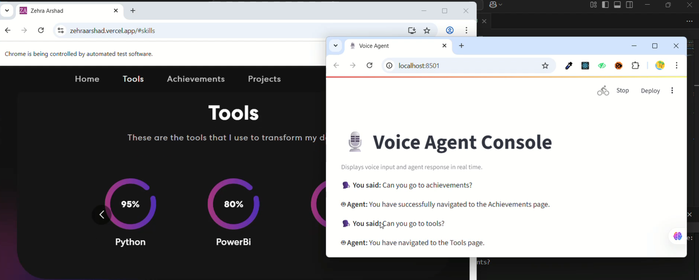

# 🗣️ Voice-Controlled Browser Automation Agent

This project is a voice-activated AI assistant that listens to spoken commands, converts them to text, processes them using a LangChain agent with Groq’s LLaMA 3 model, and performs browser automation via Selenium. All interactions are displayed in a basic Streamlit frontend.

---
## [Demo Video](https://www.youtube.com/watch?v=zIK7mD8pZOc)

## Working

## 🚀 Features

- 🎙️ **Voice to Text** using Speech Recognition (via `assembly-ai`)
- 🧠 **Natural Language Understanding** via LangChain + Groq (`llama3-8b-8192`)
- 🧪 **Tool Use**: Custom tools defined using `@tool` decorators
- 🧭 **Browser Automation** using Selenium WebDriver
- 🖥️ **Real-Time UI Feedback** using Streamlit
- 🔁 **Continuous Listening Loop** with memory to avoid repetition

---

## 🧰 Tech Stack

| Component            | Tech Used                          |
|----------------------|------------------------------------|
| **Voice Recognition** | `AssemblyAI`|
| **Language Model**    | `LangChain`, `ChatGroq`, `llama3-8b-8192` |
| **Tool Agent**        | `LangGraph` (for LLM tool chaining) |
| **Browser Control**   | `Selenium`                         |
| **Frontend**          | `Streamlit`                        |
| **TTS (optional)**    | `pyttsx3` or `gTTS` (optional/experimental) |
| **Environment Mgmt**  | `Python >= 3.9`, `conda` or `venv` |

